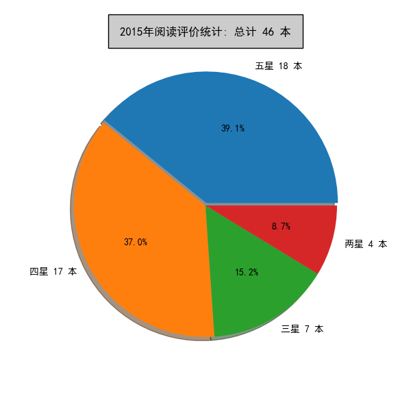
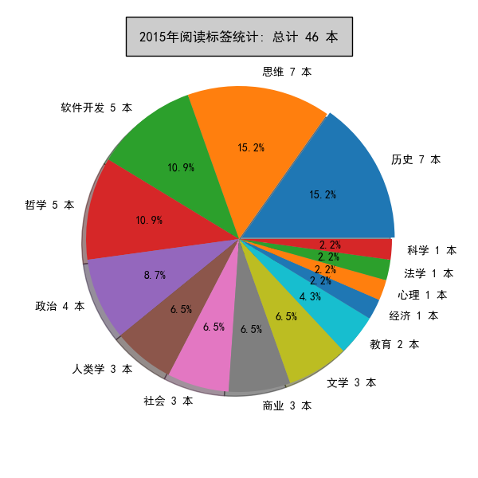

## 2015年阅读统计，本页面由代码自动生成
## 总计阅读 46 本
### 评价统计:

 > 五星图书 18 本，占比 39.1%  
 > 四星图书 17 本，占比 37.0%  
 > 三星图书 7 本，占比 15.2%  
 > 两星图书 4 本，占比 8.7%  

### 标签统计:

 > 历史 7 本  
 > 思维 7 本  
 > 软件开发 5 本  
 > 哲学 5 本  
 > 政治 4 本  
 > 人类学 3 本  
 > 社会 3 本  
 > 商业 3 本  
 > 文学 3 本  
 > 教育 2 本  
 > 经济 1 本  
 > 心理 1 本  
 > 法学 1 本  
 > 科学 1 本  

### 历史: 7 本
#### No.1 现代世界史（影印第10版）
 > 图书名称：[现代世界史（影印第10版）](https://book.douban.com/subject/25831575/)  
 > 豆瓣链接：[https://book.douban.com/subject/25831575/](https://book.douban.com/subject/25831575/)  
 > 出版信息：[美]R.R.帕尔默、乔·科尔顿、劳埃德·克莱默 / 世界图书出版公司·后浪出版公司 / 2014-1 / 188.00元（上下册）  
 > 标签：历史&nbsp;&nbsp;&nbsp;&nbsp;&nbsp;&nbsp;&nbsp;&nbsp;&nbsp;&nbsp;&nbsp;&nbsp;&nbsp;&nbsp;&nbsp;&nbsp;评分：**★★★★★**  
 > 我的评论：非常合适的世界史入门，没看过《全球通史》不好比较，但作者能把各时期的发展趋势、脉络以及前后关联影响分析的头头是道，让全球历史长河连贯系统地展现在读者眼前。  

#### No.2 你一定爱读的极简欧洲史
 > 图书名称：[你一定爱读的极简欧洲史](https://book.douban.com/subject/5366248/)  
 > 豆瓣链接：[https://book.douban.com/subject/5366248/](https://book.douban.com/subject/5366248/)  
 > 出版信息：约翰·赫斯特（John Hirst） / 席玉苹 / 广西师范大学出版社 / 2011-11-25 / 25.00元  
 > 标签：历史&nbsp;&nbsp;&nbsp;&nbsp;&nbsp;&nbsp;&nbsp;&nbsp;&nbsp;&nbsp;&nbsp;&nbsp;&nbsp;&nbsp;&nbsp;&nbsp;评分：**★★★★★**  
 > 我的评论：关于欧洲史非常不错的入门书籍，框架梳理的不错；行文有趣，翻译也给力，如公国伯爵对皇帝的态度是“帝力于我何有哉！”，又如伏尔泰评神圣罗马帝国“既不神圣又不罗马亦非帝国”。全书讨论这个问题Q：“今天的欧洲和欧洲引领的现代文明是如何形成的?”。A：“希腊罗马的科学精神+基督教+日耳曼蛮族入侵”的三元合力形成了多元化、弱政府、多方角力的欧洲社会。  

#### No.3 蒋介石与现代中国
 > 图书名称：[蒋介石与现代中国](https://book.douban.com/subject/10797092/)  
 > 豆瓣链接：[https://book.douban.com/subject/10797092/](https://book.douban.com/subject/10797092/)  
 > 出版信息：[美] 陶涵 / 林添贵 / 中信出版社 / 2012-8 / 68.00元  
 > 标签：历史&nbsp;&nbsp;&nbsp;&nbsp;&nbsp;&nbsp;&nbsp;&nbsp;&nbsp;&nbsp;&nbsp;&nbsp;&nbsp;&nbsp;&nbsp;&nbsp;评分：**★★★★★**  
 > 我的评论：作者给蒋家父子都写了传，当看台版无删节版。此书以在蒋与美关系上着墨甚多，对共党评价甚低。作者树立了一位正心诚意的儒家基督信仰相结合的民族英雄。蒋在政治，战略上还是很有远见的，可是生不逢时，上位亦不在时。  

#### No.4 革命年代
 > 图书名称：[革命年代](https://book.douban.com/subject/4229282/)  
 > 豆瓣链接：[https://book.douban.com/subject/4229282/](https://book.douban.com/subject/4229282/)  
 > 出版信息：高华 / 广东人民出版社 / 2012-7 / 42.00元  
 > 标签：历史&nbsp;&nbsp;&nbsp;&nbsp;&nbsp;&nbsp;&nbsp;&nbsp;&nbsp;&nbsp;&nbsp;&nbsp;&nbsp;&nbsp;&nbsp;&nbsp;评分：**★★★★**  
 > 我的评论：高华名声在外啊，书中对民国以及老蒋败退台湾的论述并无新意，不过对延安文化文化的形成以及50年代国家级别的“整合”进程倒是有很多不错的见解。因为稀少而弥足珍贵，所以四星。  

#### No.5 大门口的陌生人
 > 图书名称：[大门口的陌生人](https://book.douban.com/subject/25918704/)  
 > 豆瓣链接：[https://book.douban.com/subject/25918704/](https://book.douban.com/subject/25918704/)  
 > 出版信息：[美] 魏斐德 / 王小荷 / 新星出版社 / 2014-7 / 39.00元  
 > 标签：历史&nbsp;&nbsp;&nbsp;&nbsp;&nbsp;&nbsp;&nbsp;&nbsp;&nbsp;&nbsp;&nbsp;&nbsp;&nbsp;&nbsp;&nbsp;&nbsp;评分：**★★★★**  
 > 我的评论：本书以英国侵略中国的两次鸦片战争为线索，研究这一历史时期广州和广东省的社会动态，如官府、绅士、团练、农民等对外国的态度；各自的活动、相互间的关系以及变化，从而揭示中国近代史的开始阶段的某些动向。  

#### No.6 清代学术概论
 > 图书名称：[清代学术概论](https://book.douban.com/subject/1005567/)  
 > 豆瓣链接：[https://book.douban.com/subject/1005567/](https://book.douban.com/subject/1005567/)  
 > 出版信息：梁启超 / 上海古籍出版社 / 1998-01-01 / 9.20  
 > 标签：历史&nbsp;&nbsp;&nbsp;&nbsp;&nbsp;&nbsp;&nbsp;&nbsp;&nbsp;&nbsp;&nbsp;&nbsp;&nbsp;&nbsp;&nbsp;&nbsp;评分：**★★★★**  
 > 我的评论：对清代学术发展的脉络把握得非常到位，值得了解。“以复古为解放”，敢于质疑、勤于考证，于是依次质疑驳明性理学、宋学、汉学等等。  

#### No.7 蒋介石传
 > 图书名称：[蒋介石传](https://book.douban.com/subject/4210829/)  
 > 豆瓣链接：[https://book.douban.com/subject/4210829/](https://book.douban.com/subject/4210829/)  
 > 出版信息：布赖恩·克罗泽 / 封长虹 / 国际文化出版社 / 2010-1 / 36.00元  
 > 标签：历史&nbsp;&nbsp;&nbsp;&nbsp;&nbsp;&nbsp;&nbsp;&nbsp;&nbsp;&nbsp;&nbsp;&nbsp;&nbsp;&nbsp;&nbsp;&nbsp;评分：**★★★**  
 > 我的评论：挺不错的传记，书中对各历史人物与历史事件的评价都挺中肯与客观，这一本算是极简版的传记，结合之前看过《蒋介石日记》，《蒋经国传》对蒋的了解更加形象具体了。  

### 思维: 7 本
#### No.8 沟通的艺术（插图修订第14版）
 > 图书名称：[沟通的艺术（插图修订第14版）](https://book.douban.com/subject/26275861/)  
 > 豆瓣链接：[https://book.douban.com/subject/26275861/](https://book.douban.com/subject/26275861/)  
 > 出版信息：[美]罗纳德·B·阿德勒、拉塞尔·F·普罗科特 / 黄素菲、李恩 / 世界图书出版公司·后浪出版公司 / 2015-1 / 68.00元  
 > 标签：思维&nbsp;&nbsp;&nbsp;&nbsp;&nbsp;&nbsp;&nbsp;&nbsp;&nbsp;&nbsp;&nbsp;&nbsp;&nbsp;&nbsp;&nbsp;&nbsp;评分：**★★★★★**  
 > 我的评论：很全，很潮，很有根据的关于沟通的书籍。首先是要能认识自我的需求，其后学会倾听别人的需求，运用语言表达自己的感受与请求，从而促进关系。  

#### No.9 非暴力沟通实践篇
 > 图书名称：[非暴力沟通实践篇](https://book.douban.com/subject/25985811/)  
 > 豆瓣链接：[https://book.douban.com/subject/25985811/](https://book.douban.com/subject/25985811/)  
 > 出版信息：[美]马歇尔·卢森堡 / 梁欣琢 / 江苏人民出版社 / 2014-10-1 / 32.00  
 > 标签：思维&nbsp;&nbsp;&nbsp;&nbsp;&nbsp;&nbsp;&nbsp;&nbsp;&nbsp;&nbsp;&nbsp;&nbsp;&nbsp;&nbsp;&nbsp;&nbsp;评分：**★★★★★**  
 > 我的评论：用作者的治疗案例演示如何将非暴力理论在实践中落地。最后一章“实践灵性”道出了非暴力沟通的人性关怀与哲学理念，从这个层面上去理解就能明白为什么要运用非暴力沟通。因为育儿，看过《怎么听 孩子才会说，如何说 孩子才会听》《父母效能训练手册》《孩子把你的手给我》《沟通的艺术》等书籍，发现各位大师推崇的沟通理念与技巧都相似，足可见这种沟通方式的重要。  

#### No.10 非暴力沟通
 > 图书名称：[非暴力沟通](https://book.douban.com/subject/3533221/)  
 > 豆瓣链接：[https://book.douban.com/subject/3533221/](https://book.douban.com/subject/3533221/)  
 > 出版信息：[美] 马歇尔·卢森堡 / 阮胤华 / 华夏出版社 / 2009-1 / 29.00元  
 > 标签：思维&nbsp;&nbsp;&nbsp;&nbsp;&nbsp;&nbsp;&nbsp;&nbsp;&nbsp;&nbsp;&nbsp;&nbsp;&nbsp;&nbsp;&nbsp;&nbsp;评分：**★★★★★**  
 > 我的评论：非暴力沟通四部曲：观察行为，体会感受，发现需求，提出请求。无论是表达自己还是倾听他人都可以用上非暴力沟通，这样的沟通方式误会最少，成效最大，其根基在于尊重与体会自己或他人的需求，提出建设性的方案来满足这些需求，这是爱的表达与沟通方式。在情侣、夫妻、父子等之间交流中都能得到实践应用。  

#### No.11 娱乐至死
 > 图书名称：[娱乐至死](https://book.douban.com/subject/1062193/)  
 > 豆瓣链接：[https://book.douban.com/subject/1062193/](https://book.douban.com/subject/1062193/)  
 > 出版信息：[美] 尼尔·波兹曼 / 章艳 / 广西师范大学出版社 / 2011-6 / 29.80元  
 > 标签：思维&nbsp;&nbsp;&nbsp;&nbsp;&nbsp;&nbsp;&nbsp;&nbsp;&nbsp;&nbsp;&nbsp;&nbsp;&nbsp;&nbsp;&nbsp;&nbsp;评分：**★★★★**  
 > 我的评论：如果它强加于自己很高的使命，或者把自己表现成重要文化对话的载体，那么危险就出现了。具有讽刺意义的是，这样危险的事情正是知识分子和批评家一直不断鼓励电视去做的。  

#### No.12 稀缺
 > 图书名称：[稀缺](https://book.douban.com/subject/26178426/)  
 > 豆瓣链接：[https://book.douban.com/subject/26178426/](https://book.douban.com/subject/26178426/)  
 > 出版信息：塞德希尔·穆来纳森、埃尔德·沙菲尔 / 魏薇、龙志勇 / 浙江人民出版社 / 2014-11 / 56.90元  
 > 标签：思维&nbsp;&nbsp;&nbsp;&nbsp;&nbsp;&nbsp;&nbsp;&nbsp;&nbsp;&nbsp;&nbsp;&nbsp;&nbsp;&nbsp;&nbsp;&nbsp;评分：**★★★**  
 > 我的评论：稀缺会抢占心智带宽，专注力提高但关注面缩小，所以稀缺有利有弊。通过设置提醒、自动关联、在余闲的时候未雨绸缪等方式可以减少稀缺导致的失误。这是一本典型的商业书籍，书后湛庐文化说“对于商业图书来说，80%的精华价值可能仅占20%的页码”，所以看看豆瓣以及评论足矣。  

#### No.13 人生有何意义
 > 图书名称：[人生有何意义](https://book.douban.com/subject/19956259/)  
 > 豆瓣链接：[https://book.douban.com/subject/19956259/](https://book.douban.com/subject/19956259/)  
 > 出版信息：胡适 / 九州出版社 / 2013-1 / 32.00元  
 > 标签：思维&nbsp;&nbsp;&nbsp;&nbsp;&nbsp;&nbsp;&nbsp;&nbsp;&nbsp;&nbsp;&nbsp;&nbsp;&nbsp;&nbsp;&nbsp;&nbsp;评分：**★★★**  
 > 我的评论：前半部分科学的人生观值得看看,后面自传部分可以不看也罢.这一本的内容参差不齐,不如<容忍比自由更重要>,编者有堆砌的嫌疑.  

#### No.14 习惯的力量
 > 图书名称：[习惯的力量](https://book.douban.com/subject/20507212/)  
 > 豆瓣链接：[https://book.douban.com/subject/20507212/](https://book.douban.com/subject/20507212/)  
 > 出版信息：[美] 查尔斯·杜希格 (Charles Duhigg) / 吴奕俊、曹烨 / 中信出版社 / 2013-3 / 42.00元  
 > 标签：思维&nbsp;&nbsp;&nbsp;&nbsp;&nbsp;&nbsp;&nbsp;&nbsp;&nbsp;&nbsp;&nbsp;&nbsp;&nbsp;&nbsp;&nbsp;&nbsp;评分：**★★★**  
 > 我的评论：习惯回路：暗示-惯常行为-奖赏，改变习惯不是要去掉这个回路，而是替换其中的惯常行为。全书就这么点东西，看第一部分足矣，其他部分是凑字数的。  

### 软件开发: 5 本
#### No.15 编码
 > 图书名称：[编码](https://book.douban.com/subject/4822685/)  
 > 豆瓣链接：[https://book.douban.com/subject/4822685/](https://book.douban.com/subject/4822685/)  
 > 出版信息：[美] Charles Petzold / 左飞、薛佟佟 / 电子工业出版社 / 2010 / 55.00元  
 > 标签：软件开发&nbsp;&nbsp;&nbsp;&nbsp;&nbsp;&nbsp;&nbsp;&nbsp;&nbsp;&nbsp;&nbsp;&nbsp;&nbsp;&nbsp;&nbsp;&nbsp;评分：**★★★★★**  
 > 我的评论：从硬件与软件角度讲述计算机是如何工作的，综合了物理学，电学，电子学，数学等多方面的知识，从亲自组装一个手电筒开始，讲述其工作原理，然后扩展到计算机的基础设施，如何表示信息、存储信息、传输信息，如何进行加减运算等等。总的来说是非常不错的一本计算机工作原理科普书籍。作者亦是大牛，写过《Windows程序设计》这边经典大作，现已经出到第五版了。  

#### No.16 理解Unix进程
 > 图书名称：[理解Unix进程](https://book.douban.com/subject/24298701/)  
 > 豆瓣链接：[https://book.douban.com/subject/24298701/](https://book.douban.com/subject/24298701/)  
 > 出版信息：Jesse Storimer / 门佳 / 人民邮电出版社 / 2013-6 / 29.00元  
 > 标签：软件开发&nbsp;&nbsp;&nbsp;&nbsp;&nbsp;&nbsp;&nbsp;&nbsp;&nbsp;&nbsp;&nbsp;&nbsp;&nbsp;&nbsp;&nbsp;&nbsp;评分：**★★★★**  
 > 我的评论：介绍 unix 进程知识，简洁实用．  

#### No.17 Objective-C高级编程
 > 图书名称：[Objective-C高级编程](https://book.douban.com/subject/24720270/)  
 > 豆瓣链接：[https://book.douban.com/subject/24720270/](https://book.douban.com/subject/24720270/)  
 > 出版信息：坂本一树 (Kazuki Sakamoto)、古本智彦 (Tomohiko Furumoto) / 黎 华 / 人民邮电出版社 / 2013-6-1 / CNY 49.00  
 > 标签：软件开发&nbsp;&nbsp;&nbsp;&nbsp;&nbsp;&nbsp;&nbsp;&nbsp;&nbsp;&nbsp;&nbsp;&nbsp;&nbsp;&nbsp;&nbsp;&nbsp;评分：**★★★★**  
 > 我的评论：对objc的内存管理机制以及block的实现原理讲得很透彻，对GCD的使用也介绍得很全面。适合进阶阅读。前面两个主题稍显啰嗦，总体还是不错的。  

#### No.18 Android开发精要
 > 图书名称：[Android开发精要](https://book.douban.com/subject/11530748/)  
 > 豆瓣链接：[https://book.douban.com/subject/11530748/](https://book.douban.com/subject/11530748/)  
 > 出版信息：范怀宇 / 机械工业出版社 / 2012-8 / 69.00元  
 > 标签：软件开发&nbsp;&nbsp;&nbsp;&nbsp;&nbsp;&nbsp;&nbsp;&nbsp;&nbsp;&nbsp;&nbsp;&nbsp;&nbsp;&nbsp;&nbsp;&nbsp;评分：**★★★★**  
 > 我的评论：如果说前面的两本都和 App 开发都没多大直接联系，那么这一本就合 App 开发有较大关系了。这一本的好处是比较系统全面地讲述 App 相关的各要素，从这个角度来理解框架中的那些部分直接和 App 开发相关又起什么作用。  

#### No.19 Android应用性能优化
 > 图书名称：[Android应用性能优化](https://book.douban.com/subject/19976838/)  
 > 豆瓣链接：[https://book.douban.com/subject/19976838/](https://book.douban.com/subject/19976838/)  
 > 出版信息：[法] Hervé Guihot / 白龙 / 人民邮电出版社 / 2012-10 / 49.00元  
 > 标签：软件开发&nbsp;&nbsp;&nbsp;&nbsp;&nbsp;&nbsp;&nbsp;&nbsp;&nbsp;&nbsp;&nbsp;&nbsp;&nbsp;&nbsp;&nbsp;&nbsp;评分：**★★**  
 > 我的评论：专门讲app优化的各种实用技巧嘛说不上，有点东拼西凑凑页数的味道，只能说有一些零散的知识点在哪里吧，但也并不多。  

### 哲学: 5 本
#### No.20 先秦政治思想史
 > 图书名称：[先秦政治思想史](https://book.douban.com/subject/5990878/)  
 > 豆瓣链接：[https://book.douban.com/subject/5990878/](https://book.douban.com/subject/5990878/)  
 > 出版信息：梁启超 / 岳麓书社 / 2010-12 / 24.00元  
 > 标签：哲学&nbsp;&nbsp;&nbsp;&nbsp;&nbsp;&nbsp;&nbsp;&nbsp;&nbsp;&nbsp;&nbsp;&nbsp;&nbsp;&nbsp;&nbsp;&nbsp;评分：**★★★★★**  
 > 我的评论：任公不愧为学贯中西的国学大师，文笔、见地、治学思路都超凡脱俗，对先秦四大流派儒道墨法都有精辟的概述与对比辨析，并能中西对比。书中观点亦有瑕疵，如认为道家的出现晚于儒家，但总体瑕不隐瑜。若论国学入门，力推此书！  

#### No.21 儒家哲学
 > 图书名称：[儒家哲学](https://book.douban.com/subject/4097069/)  
 > 豆瓣链接：[https://book.douban.com/subject/4097069/](https://book.douban.com/subject/4097069/)  
 > 出版信息：梁启超 撰 / 世纪文景 上海人民出版社 / 2009年11月 / 32.00元  
 > 标签：哲学&nbsp;&nbsp;&nbsp;&nbsp;&nbsp;&nbsp;&nbsp;&nbsp;&nbsp;&nbsp;&nbsp;&nbsp;&nbsp;&nbsp;&nbsp;&nbsp;评分：**★★★★★**  
 > 我的评论：任公以其深厚的国学功底高屋建瓴地讲了儒家哲学是什么，两千年的的变迁史以及研究哪些问题。曰：用功所在：“修己安人”，最高目的：“内圣外王”，修炼之路：“格物致知诚意正心修身”以达修己与内圣，“齐家治国平天下”以达安人与外王。根基在修身，修“智仁勇”以达德。又分别就儒家历代所辩论的问题以说明其变迁之路：性之善恶（孟荀）、仁义之内外（告孟）、理欲（宋儒）、知行（明儒）。最后讨论了儒家的三大问题：性善恶、天命、心体问题。  

#### No.22 梁启超讲阳明心学
 > 图书名称：[梁启超讲阳明心学](https://book.douban.com/subject/25847282/)  
 > 豆瓣链接：[https://book.douban.com/subject/25847282/](https://book.douban.com/subject/25847282/)  
 > 出版信息：许葆云 评注、梁启超 著 / 陕西人民出版社 / 2014-3 / 25.00  
 > 标签：哲学&nbsp;&nbsp;&nbsp;&nbsp;&nbsp;&nbsp;&nbsp;&nbsp;&nbsp;&nbsp;&nbsp;&nbsp;&nbsp;&nbsp;&nbsp;&nbsp;评分：**★★★★**  
 > 我的评论：孔孟之后，只有儒教儒术，而无儒学，要到阳明才再度重新重视仁义的内圣观念：致良知，知行合一，就是要有辨是非之心，为善去恶之行。两人的讲解都还不错。  

#### No.23 中国文化要义
 > 图书名称：[中国文化要义](https://book.douban.com/subject/1315213/)  
 > 豆瓣链接：[https://book.douban.com/subject/1315213/](https://book.douban.com/subject/1315213/)  
 > 出版信息：梁漱溟 / 上海人民出版社 / 2005-05 / 25.00元  
 > 标签：哲学&nbsp;&nbsp;&nbsp;&nbsp;&nbsp;&nbsp;&nbsp;&nbsp;&nbsp;&nbsp;&nbsp;&nbsp;&nbsp;&nbsp;&nbsp;&nbsp;评分：**★★★★**  
 > 我的评论：梁提出的中国的家族生活与西方的集团生活导致中西方文化差异，不敢苟同，尤其是西方的集团生活。我觉得“熟人社会”与“陌生人社会”的区别导致的更为精准。书中关于阶级区别的论述亦是大受马克思主义阶级论影响。除此之外，书中大部分观点都很正，如中国人向内求索于心，而西方人向外求索于物。  

#### No.24 哲学家们都干了些什么？
 > 图书名称：[哲学家们都干了些什么？](https://book.douban.com/subject/6425061/)  
 > 豆瓣链接：[https://book.douban.com/subject/6425061/](https://book.douban.com/subject/6425061/)  
 > 出版信息：林欣浩 / 辽宁教育出版社 / 2011-5 / 26.80元  
 > 标签：哲学&nbsp;&nbsp;&nbsp;&nbsp;&nbsp;&nbsp;&nbsp;&nbsp;&nbsp;&nbsp;&nbsp;&nbsp;&nbsp;&nbsp;&nbsp;&nbsp;评分：**★★★**  
 > 我的评论：西方哲学演化与哲学家八卦史，八卦挺多，语言诙谐网络化有趣，入门可以看看，但错误也不少。  

### 政治: 4 本
#### No.25 狂热分子
 > 图书名称：[狂热分子](https://book.douban.com/subject/3057556/)  
 > 豆瓣链接：[https://book.douban.com/subject/3057556/](https://book.douban.com/subject/3057556/)  
 > 出版信息：[美] 埃里克·霍弗 / 梁永安 / 广西师范大学出版社 / 2011-6 / 34.00元  
 > 标签：政治&nbsp;&nbsp;&nbsp;&nbsp;&nbsp;&nbsp;&nbsp;&nbsp;&nbsp;&nbsp;&nbsp;&nbsp;&nbsp;&nbsp;&nbsp;&nbsp;评分：**★★★★★**  
 > 我的评论：自我若是软弱无力，最多的自由又有何用？我们参加群众运动，是为了逃避个人责任或为了得到“免于自由的自由”，即摆脱自主存在这个不能承受之重的负担的自由。 此书号称为群众运动的圣经，确名不虚传，蒙田式的行文，严谨的架构，优美的翻译，佳品。  

#### No.26 独裁者手册
 > 图书名称：[独裁者手册](https://book.douban.com/subject/25881102/)  
 > 豆瓣链接：[https://book.douban.com/subject/25881102/](https://book.douban.com/subject/25881102/)  
 > 出版信息：布鲁斯·布尔诺·德·梅斯奎塔 (Mesquita B.B.D.)、阿拉斯泰尔·史密斯 (Smith A.) / 骆伟阳 / 江苏文艺出版社 / 2014-5-1 / CNY 42.00  
 > 标签：政治&nbsp;&nbsp;&nbsp;&nbsp;&nbsp;&nbsp;&nbsp;&nbsp;&nbsp;&nbsp;&nbsp;&nbsp;&nbsp;&nbsp;&nbsp;&nbsp;评分：**★★★★★**  
 > 我的评论：这是一部解刨政治权力运作机制的大作，这个模式适用于民主政府，也适用于独裁政府，还适用于一切有权力的场所，如公司、组织等等。该模式以权力为中心，分析了权力的构成（三个维度），如何获取、维持权力，如何变革等等。将传统分离的民主、独裁认知统一到一个模式下，观点独到犀利。这样一本书能在中国出版实属不易，自然翻译过程中译者必须做一些和谐的功夫。坦白地说，这本书译文流畅，观点忠于原著，只有部分和中国相关的“敏感”论据被删除，其余都保留完整，实属佳品。鉴于很多人怀疑心重，我也有心一睹原著风貌，因此搜寻原文，将我找到的中英差异列在这里，让大家对这本删节书的质量心里有个谱。http://kesain.lofter.com/post/3aa744_65cd0a4  

#### No.27 容忍与自由
 > 图书名称：[容忍与自由](https://book.douban.com/subject/6558202/)  
 > 豆瓣链接：[https://book.douban.com/subject/6558202/](https://book.douban.com/subject/6558202/)  
 > 出版信息：胡适 著、潘光哲 编 / 法律出版社 / 2011-6-1 / 34.00元  
 > 标签：政治&nbsp;&nbsp;&nbsp;&nbsp;&nbsp;&nbsp;&nbsp;&nbsp;&nbsp;&nbsp;&nbsp;&nbsp;&nbsp;&nbsp;&nbsp;&nbsp;评分：**★★★★**  
 > 我的评论：容忍比自由更重要，大胆假设小心求证。OK，这是一本常识读本，浅显而又非常重要的常识。  

#### No.28 社会主义
 > 图书名称：[社会主义](https://book.douban.com/subject/3260366/)  
 > 豆瓣链接：[https://book.douban.com/subject/3260366/](https://book.douban.com/subject/3260366/)  
 > 出版信息：（奥地利）路德维希·冯·米瑟斯 / 王建民、冯克利、崔树义 / 中国社会科学出版社 / 2008-05-01 / 45.00元  
 > 标签：政治&nbsp;&nbsp;&nbsp;&nbsp;&nbsp;&nbsp;&nbsp;&nbsp;&nbsp;&nbsp;&nbsp;&nbsp;&nbsp;&nbsp;&nbsp;&nbsp;评分：**★★★★**  
 > 我的评论：系统地从经济与社会的角度比较社会主义与自由主义，论证社会主义的不可行，尤其是从不能进行经济预算这个根本缺陷判了社会主义的死刑－社会主义必然导致贫穷，他的学生哈耶克则通过《通往奴役之路》论证了社会主义导致奴役。作者是坚定的自由主义者，他从社会分工有利于社会全体福利这个根本点出发，论证了生产资料私有制的是一切合理经济制度的基础。书中小部分章节中有对社会主义骂街的文笔出现--这是令人遗憾的瑕疵。  

### 人类学: 3 本
#### No.29 人类简史
 > 图书名称：[人类简史](https://book.douban.com/subject/25985021/)  
 > 豆瓣链接：[https://book.douban.com/subject/25985021/](https://book.douban.com/subject/25985021/)  
 > 出版信息：[以色列]尤瓦尔·赫拉利 / 林俊宏 / 中信出版社 / 2014-11-1 / CNY 68.00  
 > 标签：人类学&nbsp;&nbsp;&nbsp;&nbsp;&nbsp;&nbsp;&nbsp;&nbsp;&nbsp;&nbsp;&nbsp;&nbsp;&nbsp;&nbsp;&nbsp;&nbsp;评分：**★★★★★**  
 > 我的评论：70后作者博闻广见，将生物学、生态学、经济学、政治学、人类学、历史、哲学等统摄进人类的演化史里。认知革命、农业革命与科学革命是演化路线，而讲故事或虚构或愿景的能力是区别于其他物种的必杀技，于是金钱、帝国或宗教能够形成合力。此书写得非常有趣，抱着普世关怀，从不同角度去看待问题，涵括了《枪炮》、《自私的基因》、《增长的极限》等众多书中的观点，非常适合入门与激发兴趣。  

#### No.30 枪炮、病菌与钢铁
 > 图书名称：[枪炮、病菌与钢铁](https://book.douban.com/subject/1813841/)  
 > 豆瓣链接：[https://book.douban.com/subject/1813841/](https://book.douban.com/subject/1813841/)  
 > 出版信息：[美] 贾雷德·戴蒙德 / 谢延光 / 上海世纪出版集团 / 2006-4-1 / 45.00元  
 > 标签：人类学&nbsp;&nbsp;&nbsp;&nbsp;&nbsp;&nbsp;&nbsp;&nbsp;&nbsp;&nbsp;&nbsp;&nbsp;&nbsp;&nbsp;&nbsp;&nbsp;评分：**★★★★★**  
 > 我的评论：详细地论证了公元1800之前的历史很大部分是由于地理环境决定的。丰富的可驯化动植物以及适宜的气氛，导致新月地区与东亚最先进入生产粮食的定居社会，粮食生产与人口增多相互促进，引发文字、社会组织结构、技术以及病菌进化，而欧亚大陆东西向同纬度上气候条件相近的广阔大陆又有利于它们的传播。这一切积累到15世纪，欧洲人在枪炮、病菌以及其他先进技术与组织管理的帮助下踏上新大陆，将没有免疫力以及处于军事劣势的原住民征服或消灭了。  

#### No.31 第三种黑猩猩
 > 图书名称：[第三种黑猩猩](https://book.douban.com/subject/10607615/)  
 > 豆瓣链接：[https://book.douban.com/subject/10607615/](https://book.douban.com/subject/10607615/)  
 > 出版信息：贾雷德·戴蒙德 / 王道还 / 上海世纪出版股份有限公司,上海译文出版社 / 2012-5 / 38.00元  
 > 标签：人类学&nbsp;&nbsp;&nbsp;&nbsp;&nbsp;&nbsp;&nbsp;&nbsp;&nbsp;&nbsp;&nbsp;&nbsp;&nbsp;&nbsp;&nbsp;&nbsp;评分：**★★★**  
 > 我的评论：有进化论方面的知识能大幅提升此书的阅读速度。这本书比较有新意的在于地理决定论，而且这个理论也只使用于蒸汽革命之前的慢速社会，而不适用于全球化的今天。作者认为游牧业的生活优于农业，农业带来阶级&流行病等。这个观点不敢苟同，分工合作能提高物质生活水平，这点农业社会完胜，而幸福是主观感受无从比较。作者继而关注种族灭绝、物种消亡、环境破坏等，这些问题确实是曾经人类扩张的恶果，但现在人们意识到了，也在采取一些积极行动。从这个意义上讲，或许这正是作者写此书的目的。  

### 社会: 3 本
#### No.32 增长的极限
 > 图书名称：[增长的极限](https://book.douban.com/subject/24745507/)  
 > 豆瓣链接：[https://book.douban.com/subject/24745507/](https://book.douban.com/subject/24745507/)  
 > 出版信息：（美）德内拉•梅多斯、乔根•兰德斯、丹尼斯•梅多斯 / 李涛、王智勇 / 机械工业出版社 / 2013-6 / 40.00  
 > 标签：社会&nbsp;&nbsp;&nbsp;&nbsp;&nbsp;&nbsp;&nbsp;&nbsp;&nbsp;&nbsp;&nbsp;&nbsp;&nbsp;&nbsp;&nbsp;&nbsp;评分：**★★★★**  
 > 我的评论：书中内容在现在已经算是常识了，放在30年前，确实是振聋发聩的：不要过度追求增长，要可持续发展。感谢作者们对这个理念的推广，使得人类对此重视并行动起来，同时这本书也是系统思考实践非常好的范例。内容给三星，另加一星致敬！  

#### No.33 无缘社会
 > 图书名称：[无缘社会](https://book.douban.com/subject/25822105/)  
 > 豆瓣链接：[https://book.douban.com/subject/25822105/](https://book.douban.com/subject/25822105/)  
 > 出版信息：日本NHK特别节目录制组 / 高培明 / 上海译文出版社 / 2014-3-1 / CNY 38.00  
 > 标签：社会&nbsp;&nbsp;&nbsp;&nbsp;&nbsp;&nbsp;&nbsp;&nbsp;&nbsp;&nbsp;&nbsp;&nbsp;&nbsp;&nbsp;&nbsp;&nbsp;评分：**★★**  
 > 我的评论：有事实（越来越多的无人知晓的孤独死亡），还包括发现这个事实的采访过程，抛出问题但缺少观点以及稳妥的解决办法。挺薄的一本书，由多名一些记者采访记录而成，将采访过程当小说写，有堆砌文字的嫌疑。  

#### No.34 群氓之族
 > 图书名称：[群氓之族](https://book.douban.com/subject/26300044/)  
 > 豆瓣链接：[https://book.douban.com/subject/26300044/](https://book.douban.com/subject/26300044/)  
 > 出版信息：[美] 哈罗德·伊罗生 / 邓伯宸 / 广西师范大学出版社 / 2015-1 / 43.00  
 > 标签：社会&nbsp;&nbsp;&nbsp;&nbsp;&nbsp;&nbsp;&nbsp;&nbsp;&nbsp;&nbsp;&nbsp;&nbsp;&nbsp;&nbsp;&nbsp;&nbsp;评分：**★★**  
 > 我的评论：人的归属感与自尊心需求使得人们渴望属于某个集体获得认同，而族群则是最易辨识与方便的集体。自“冻结位阶”的传统社会瓦解以来，世界各地的民族运动风起云涌，世界“被割裂”（欧洲是个异类），人群被重新划分，冲突再起。广师大出版社将这本书与《乌合之众》、《狂热分子》做在一起，个人感觉前两本确属佳品，而这本三句话能说清楚的东西却用畅销书的写法凑了一本书。btw，翻译还是不错的。同类型的书籍还有《文明的冲突与世界秩序的重建》，那本是以文化为模型，而这本是以族群为模型。  

### 商业: 3 本
#### No.35 精益创业
 > 图书名称：[精益创业](https://book.douban.com/subject/10945606/)  
 > 豆瓣链接：[https://book.douban.com/subject/10945606/](https://book.douban.com/subject/10945606/)  
 > 出版信息：[美] 埃里克·莱斯 / 吴彤 / 中信出版社 / 2012-8 / 49.00元  
 > 标签：商业&nbsp;&nbsp;&nbsp;&nbsp;&nbsp;&nbsp;&nbsp;&nbsp;&nbsp;&nbsp;&nbsp;&nbsp;&nbsp;&nbsp;&nbsp;&nbsp;评分：**★★★★★**  
 > 我的评论：精华理念：低成本快速试错以找准需求。焦点是需求，手段是试错，策略是低成本＆快速。与《四步创业法》理念相通，以客户为导向。  

#### No.36 四步创业法
 > 图书名称：[四步创业法](https://book.douban.com/subject/11516567/)  
 > 豆瓣链接：[https://book.douban.com/subject/11516567/](https://book.douban.com/subject/11516567/)  
 > 出版信息：[美] Steven Gary Blank / 七印部落 / 华中科技大学出版社 / 2012-8-1 / 48.00  
 > 标签：商业&nbsp;&nbsp;&nbsp;&nbsp;&nbsp;&nbsp;&nbsp;&nbsp;&nbsp;&nbsp;&nbsp;&nbsp;&nbsp;&nbsp;&nbsp;&nbsp;评分：**★★★★★**  
 > 我的评论：棒喝以创意、产品为中心的创业管理思想，作者以自己丰富的创业以及顾问经历指出从创意、产品功能、开发、销售、流程化量产的每一个步骤都需要用户来检验！尤其是前期，创业应当以用户需求为导向，否则自觉不错的创意做成产品了用户却不买账，用时髦的话说就是不在风口上。此外市场分为现有市场、细分市场、全新市场；根据产品的接纳生命曲线，客户也分为好早期（天使）客户、主流客户、怀疑者。用分清楚创业的市场类型、客户对象，采取不同的应对措施。  

#### No.37 从0到1
 > 图书名称：[从0到1](https://book.douban.com/subject/26297606/)  
 > 豆瓣链接：[https://book.douban.com/subject/26297606/](https://book.douban.com/subject/26297606/)  
 > 出版信息：彼得·蒂尔、布莱克·马斯特斯 / 高玉芳 / 中信出版股份有限公司 / 2015-1-1 / CNY 45.00  
 > 标签：商业&nbsp;&nbsp;&nbsp;&nbsp;&nbsp;&nbsp;&nbsp;&nbsp;&nbsp;&nbsp;&nbsp;&nbsp;&nbsp;&nbsp;&nbsp;&nbsp;评分：**★★**  
 > 我的评论：中信出版的典型的快餐文化，两三句话的事情扯了一本书，就是说创新&垄断，换个概念讲蓝海。盛名之下，其实难副。  

### 文学: 3 本
#### No.38 水浒传（注评本）（套装3册）
 > 图书名称：[水浒传（注评本）（套装3册）](https://book.douban.com/subject/26411281/)  
 > 豆瓣链接：[https://book.douban.com/subject/26411281/](https://book.douban.com/subject/26411281/)  
 > 出版信息：[明] 施耐庵 著、[清] 金圣叹 评 / 上海古籍出版社 / 2015-1-1 / CNY 45.00  
 > 标签：文学&nbsp;&nbsp;&nbsp;&nbsp;&nbsp;&nbsp;&nbsp;&nbsp;&nbsp;&nbsp;&nbsp;&nbsp;&nbsp;&nbsp;&nbsp;&nbsp;评分：**★★★★★**  
 > 我的评论：读了金圣叹点评本，才晓得水浒一书中许多的文法，百零八人百零八个性格，真是人物描写的典范！  

#### No.39 呼兰河传
 > 图书名称：[呼兰河传](https://book.douban.com/subject/1060852/)  
 > 豆瓣链接：[https://book.douban.com/subject/1060852/](https://book.douban.com/subject/1060852/)  
 > 出版信息：萧红 / 百花文艺出版社 / 2005-01 / 19.00  
 > 标签：文学&nbsp;&nbsp;&nbsp;&nbsp;&nbsp;&nbsp;&nbsp;&nbsp;&nbsp;&nbsp;&nbsp;&nbsp;&nbsp;&nbsp;&nbsp;&nbsp;评分：**★★★★**  
 > 我的评论："满天星光，满屋月亮，人生何如，为什么这么悲凉。" 这句话很能代表这部作品的文风，意境以及心境。  

#### No.40 悟空传
 > 图书名称：[悟空传](https://book.douban.com/subject/1003000/)  
 > 豆瓣链接：[https://book.douban.com/subject/1003000/](https://book.douban.com/subject/1003000/)  
 > 出版信息：今何在 / 光明日报出版社 / 2001-4 / 14.80元  
 > 标签：文学&nbsp;&nbsp;&nbsp;&nbsp;&nbsp;&nbsp;&nbsp;&nbsp;&nbsp;&nbsp;&nbsp;&nbsp;&nbsp;&nbsp;&nbsp;&nbsp;评分：**★★★**  
 > 我的评论：适合十几岁那个年龄看：叛逆、张狂或是勇于做自己，推倒一切权威。这句话很能反映书中的主旨“我要这天，再遮不住我眼，要这地，再埋不了我心，要这众生，都明白我意，要那诸佛，都烟消云散! ”  

### 教育: 2 本
#### No.41 父母效能训练手册
 > 图书名称：[父母效能训练手册](https://book.douban.com/subject/3759379/)  
 > 豆瓣链接：[https://book.douban.com/subject/3759379/](https://book.douban.com/subject/3759379/)  
 > 出版信息：戈登 / 天津社会科学院出版社 / 2009-6-1 / 29.80元  
 > 标签：教育&nbsp;&nbsp;&nbsp;&nbsp;&nbsp;&nbsp;&nbsp;&nbsp;&nbsp;&nbsp;&nbsp;&nbsp;&nbsp;&nbsp;&nbsp;&nbsp;评分：**★★★★★**  
 > 我的评论：一切人际交往的关键在如何交流沟通,这本书讲述了一套如何有效沟通,尤其是如何与孩子沟通的方法,因此这不仅仅是一本育儿书.这套沟通方法或理念与<非暴力沟通>非常相近,足可见"道归于一".  

#### No.42 孩子，把你的手给我
 > 图书名称：[孩子，把你的手给我](https://book.douban.com/subject/1067049/)  
 > 豆瓣链接：[https://book.douban.com/subject/1067049/](https://book.douban.com/subject/1067049/)  
 > 出版信息：[美] 海姆·G.吉诺特 / 张雪兰 / 京华出版社 / 2004-9 / 18.80元  
 > 标签：教育&nbsp;&nbsp;&nbsp;&nbsp;&nbsp;&nbsp;&nbsp;&nbsp;&nbsp;&nbsp;&nbsp;&nbsp;&nbsp;&nbsp;&nbsp;&nbsp;评分：**★★★★**  
 > 我的评论：这本书可以说是在实践《非暴力沟通》中的理论，虽然讲的是如何和孩子沟通，其实也可以扩大范围应用到一切沟通上面去：观测行为，描述自己或理解别人的感受，明白未满足的真实需求，提出期望的行动。对感受要宽容，对行为要严格，值得学习。  

### 经济: 1 本
#### No.43 自由选择（珍藏版）
 > 图书名称：[自由选择（珍藏版）](https://book.douban.com/subject/24745513/)  
 > 豆瓣链接：[https://book.douban.com/subject/24745513/](https://book.douban.com/subject/24745513/)  
 > 出版信息：（美）米尔顿弗里德曼、罗丝D.弗里德曼 / 张琦 / 机械工业出版社 / 2013-6 / 49.00  
 > 标签：经济&nbsp;&nbsp;&nbsp;&nbsp;&nbsp;&nbsp;&nbsp;&nbsp;&nbsp;&nbsp;&nbsp;&nbsp;&nbsp;&nbsp;&nbsp;&nbsp;评分：**★★★★**  
 > 我的评论：普及自由主义及对现实美国政治的针砭，反对凯恩斯的干预主义，主张有限政府，对通货膨胀有透彻的分析：通货膨胀就是货币现象，是隐形税，并针对间接选举的弊端，指出了可行的解决方案：一揽子支出限额。  

### 心理: 1 本
#### No.44 对伪心理学说不
 > 图书名称：[对伪心理学说不](https://book.douban.com/subject/6952036/)  
 > 豆瓣链接：[https://book.douban.com/subject/6952036/](https://book.douban.com/subject/6952036/)  
 > 出版信息：基思•斯坦诺维奇 / 窦东徽、刘肖岑 / 人民邮电出版社 / 2012-1-1 / 28.00元  
 > 标签：心理&nbsp;&nbsp;&nbsp;&nbsp;&nbsp;&nbsp;&nbsp;&nbsp;&nbsp;&nbsp;&nbsp;&nbsp;&nbsp;&nbsp;&nbsp;&nbsp;评分：**★★★★★**  
 > 我的评论：第七版曾叫做《与“众”不同的心理学》，这本书的重点在介绍如何用科学的思维来认识心理学，与其说是心理学，不如说是方法论、科学哲学。书中介绍了理论必须是可证伪和可验证的，验证是说要可测量与可操作，公开知识须经过同行评审；不要搞错相关与因果关系；警惕个案与见证而要重视概率；警惕可以解释一切的终极理论；重视偶然性与随机性等等科学思维。乃批判性思维在心理学上的的实际运用。  

### 法学: 1 本
#### No.45 洞穴奇案
 > 图书名称：[洞穴奇案](https://book.douban.com/subject/3697494/)  
 > 豆瓣链接：[https://book.douban.com/subject/3697494/](https://book.douban.com/subject/3697494/)  
 > 出版信息：[美] 萨伯 / 陈福勇、张世泰 / 生活·读书·新知三联书店 / 2009-06 / 18.00  
 > 标签：法学&nbsp;&nbsp;&nbsp;&nbsp;&nbsp;&nbsp;&nbsp;&nbsp;&nbsp;&nbsp;&nbsp;&nbsp;&nbsp;&nbsp;&nbsp;&nbsp;评分：**★★★★**  
 > 我的评论：这个奇案奇就奇在多种正反观点都看起来有道理，乃至无法判案。一个案子引出不同法律学派的观念，从中可以领略法律的逻辑与思维方式，更进一步能激发人思考法律、道德、社会、契约、自然法等众多主题及其关系。本书翻译欠火候，期待有佳译出现。  

### 科学: 1 本
#### No.46 自私的基因
 > 图书名称：[自私的基因](https://book.douban.com/subject/1292405/)  
 > 豆瓣链接：[https://book.douban.com/subject/1292405/](https://book.douban.com/subject/1292405/)  
 > 出版信息：(英)里查德.道金斯 / 卢允中 / 吉林人民出版社 / 1998-10 / 24.00元  
 > 标签：科学&nbsp;&nbsp;&nbsp;&nbsp;&nbsp;&nbsp;&nbsp;&nbsp;&nbsp;&nbsp;&nbsp;&nbsp;&nbsp;&nbsp;&nbsp;&nbsp;评分：**★★★★**  
 > 我的评论：meme 是一切能进行自我复制的结构，而 gene 是其中的一种。是 gene 而不是个体或群体，才是进化的选择单位。作者用这个观点来解释许多自然现象倒是挺对胃口的，但最后说文化也是一种 meme 就有扩大化的味道了。总的来说，观点新颖别致，大部分自然现象也都能解释得合情合理，值得阅读。  

