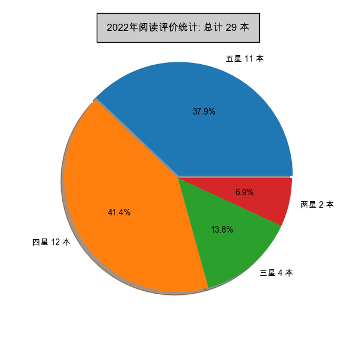
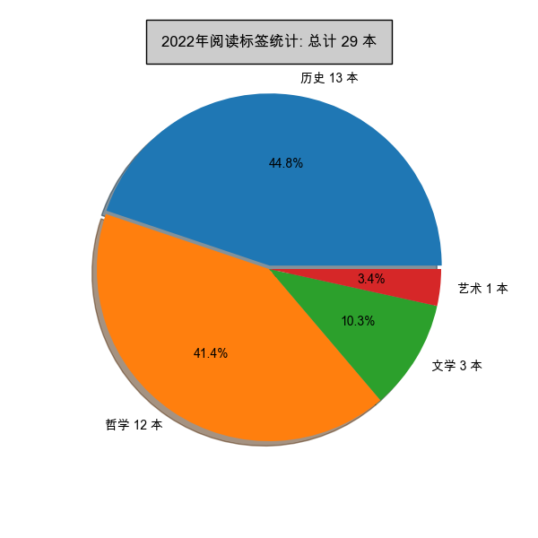

## 2022年阅读统计，本页面由代码自动生成
## 总计阅读 29 本
### 评价统计:

 > 五星图书 11 本，占比 37.9%  
 > 四星图书 12 本，占比 41.4%  
 > 三星图书 4 本，占比 13.8%  
 > 两星图书 2 本，占比 6.9%  

### 标签统计:

 > 历史 13 本  
 > 哲学 12 本  
 > 文学 3 本  
 > 艺术 1 本  

### 历史: 13 本
#### No.1 草原帝国
 > 图书名称：[草原帝国](https://book.douban.com/subject/1057653/)  
 > 豆瓣链接：[https://book.douban.com/subject/1057653/](https://book.douban.com/subject/1057653/)  
 > 出版信息：勒内·格鲁塞 / 蓝琪 / 商务印书馆 / 1998-5 / 45.00元  
 > 标签：历史&nbsp;&nbsp;&nbsp;&nbsp;&nbsp;&nbsp;&nbsp;&nbsp;&nbsp;&nbsp;&nbsp;&nbsp;&nbsp;&nbsp;&nbsp;&nbsp;评分：**★★★★★**  
 > 我的评论：多年以前读这本书，知难而退。在夯实过波斯、奥斯曼、拜占庭、俄罗斯、埃及以及汉唐等多方历史基础之后，再来读这本书，发现这是一本聚焦于欧亚草原部落的煌煌“交叉学科”巨著。来自贝加尔湖、阿尔泰山以及鄂尔浑河的游牧民族，在周期性盛衰的草原地理环境下，前仆后继地侵袭定居的农耕文明，前浪刚被农耕文明所同化或曰腐化，源源不断的后浪又来把前浪放倒。直到农耕文明掌握了枪炮，军事力量才发生根本性的逆转。斯基泰、匈奴、鲜卑、柔然、吠哒、突厥、回鹘、契丹、蒙古、女真满族这些蛮族一一登上历史舞台，影响着中国、中亚、波斯、奥斯曼、拜占庭、阿拉伯、埃及、巴尔干半岛、俄罗斯等多个文明与地区。译者是研究中亚史的专家，翻译上乘，除了部分人名及古地名要音猜，比如撒麻耳干（撒马尔罕）、报达（巴格达）、桃里寺（大不里士）。  

#### No.2 第三帝国的兴亡（上下册）
 > 图书名称：[第三帝国的兴亡（上下册）](https://book.douban.com/subject/10435653/)  
 > 豆瓣链接：[https://book.douban.com/subject/10435653/](https://book.douban.com/subject/10435653/)  
 > 出版信息：威廉·夏伊勒 / 董乐山 / 世界知识出版社 / 2012-1 / 118.00元  
 > 标签：历史&nbsp;&nbsp;&nbsp;&nbsp;&nbsp;&nbsp;&nbsp;&nbsp;&nbsp;&nbsp;&nbsp;&nbsp;&nbsp;&nbsp;&nbsp;&nbsp;评分：**★★★★★**  
 > 我的评论：这是一本以希特勒为中心，通过大量的会议及通讯记录、回忆录、亲身经历等构建的，前期着重组织建设、夺权，后期着重外交，第三帝国各种决策的形成与演化，并支线夹述陆军反希特勒。本书最精彩的部分是开战前第三帝国的上台，而开战后对战役描写则相当简略。全书布局虽有失均衡，但现场感很强，可读性佳，董老翻译也靠谱，缺点是全书无地图。  

#### No.3 东晋门阀政治
 > 图书名称：[东晋门阀政治](https://book.douban.com/subject/10758290/)  
 > 豆瓣链接：[https://book.douban.com/subject/10758290/](https://book.douban.com/subject/10758290/)  
 > 出版信息：田余庆 / 北京大学出版社 / 2012-5 / 49.00元  
 > 标签：历史&nbsp;&nbsp;&nbsp;&nbsp;&nbsp;&nbsp;&nbsp;&nbsp;&nbsp;&nbsp;&nbsp;&nbsp;&nbsp;&nbsp;&nbsp;&nbsp;评分：**★★★★★**  
 > 我的评论：通过丰富详实的史料分析东晋门阀政治的创生（琅琊王氏）、发展（郗氏、庾氏、桓氏、谢氏）、衰亡（太原王氏），以及各方势力的对抗与平衡：士族与皇族、上游与下游士族、皇权与相权、门阀士族与次等氏族、北方与南方等等。门阀政治是皇权政治在北人南渡这特定历史条件下出现的暂时性和过渡性的变态，以孝武帝尝试恢复皇权为转变，到刘宋皇权得以恢复。恢复皇权的南朝频频宫室政变，政局反而不如士族制衡的东晋稳定。可以改善的地方：加地图，加上庄园制度介绍。  

#### No.4 阿拉伯通史（第10版）
 > 图书名称：[阿拉伯通史（第10版）](https://book.douban.com/subject/26419610/)  
 > 豆瓣链接：[https://book.douban.com/subject/26419610/](https://book.douban.com/subject/26419610/)  
 > 出版信息：[美] 菲利浦·希提 (Philip K.Hitti) / 马坚 / 新世界出版社 / 2015-5-1 / 98.00元  
 > 标签：历史&nbsp;&nbsp;&nbsp;&nbsp;&nbsp;&nbsp;&nbsp;&nbsp;&nbsp;&nbsp;&nbsp;&nbsp;&nbsp;&nbsp;&nbsp;&nbsp;评分：**★★★★★**  
 > 我的评论：这部通史概要讲述了阿拉伯历史的发展脉络：阿拉伯人的祖先（闪族）、先知的出现以及伊斯兰教的兴起、四大正统哈里发时代（埋下什叶派与逊尼派分裂的种子）、伊斯兰教迅速扩张时期（波斯、中亚、北非、西班牙、地中海北岸）、伍麦叶以及阿拔斯王朝、十字军、四分五裂的割据阿拉伯小王朝时期、奥斯曼帝国。阿拉伯世界保存了被中世纪遗忘的希腊罗马文化，然后这部分精神财富在文艺复兴时期发扬光大。推荐相关视频：一口气看历史:https://douc.cc/0ARlXZ  

#### No.5 英国史
 > 图书名称：[英国史](https://book.douban.com/subject/11580186/)  
 > 豆瓣链接：[https://book.douban.com/subject/11580186/](https://book.douban.com/subject/11580186/)  
 > 出版信息：[英] 屈勒味林 / 钱端升 / 东方出版社 / 2012-7 / 87.00元  
 > 标签：历史&nbsp;&nbsp;&nbsp;&nbsp;&nbsp;&nbsp;&nbsp;&nbsp;&nbsp;&nbsp;&nbsp;&nbsp;&nbsp;&nbsp;&nbsp;&nbsp;评分：**★★★★**  
 > 我的评论：英伦三岛，先是塞尔特人移民，后是罗马人征服但没有留下啥影响，第二波是维京海盗定居，第三波诺曼人定居，后来者把前居者往威尔士、爱尔兰以及苏格兰的山上赶。诺曼、金雀花、玫瑰战争、都铎、斯图亚特、护国公、汉诺威各个王朝纷至沓来。英国人就岛而光辉隔离，对外大陆均势，对内能妥协制衡，使能从君主专制，发展为贵族国会与王室均势，进而辉格/托利党+内阁，进而扩大选权，进而为自由/保守两大党。本书最大特色在其恰当的引人深思的议论，绝非平铺直述；本书的缺点是翻译年代久远，民国语言翻译的，典雅但有文言遗风，译名与今天的截然不同，不查资料比对，难以明白。  

#### No.6 地中海与菲利普二世时代的地中海世界
 > 图书名称：[地中海与菲利普二世时代的地中海世界](https://book.douban.com/subject/27028469/)  
 > 豆瓣链接：[https://book.douban.com/subject/27028469/](https://book.douban.com/subject/27028469/)  
 > 出版信息：[法] 费尔南·布罗代尔(Fernand Braudel) / 唐家龙、曾培耿、吴模信 / 商务印书馆 / 2013-2 / 158.00  
 > 标签：历史&nbsp;&nbsp;&nbsp;&nbsp;&nbsp;&nbsp;&nbsp;&nbsp;&nbsp;&nbsp;&nbsp;&nbsp;&nbsp;&nbsp;&nbsp;&nbsp;评分：**★★★★**  
 > 我的评论：两千余页的年鉴学派巨著，即整体立体史学。从三个叠面：长时段的地理环境，中时段的社会环境以及微观的个人和事件展开论述。优缺点都明显，钜细靡遗，通过全方位的细节来勾勒1550～1600年间地中海世界的方方面面，细节过多再加上散文式的行文，使得总结性的论述难以直观把握与理解。知识面涉及甚广，尤其是地理与人物（加上混乱的译名），不随时查阅电子地图与wiki，难以构建知识图谱。校对与翻译非常对不起原著，尤其是第二部的长句翻译不够通顺。很难想象这样一部优雅的大部头是一个人写出来的（佩服），而多个人的翻译却这等糟糕（遗憾）。推荐相关纪录片：真正的权力的游戏。  

#### No.7 奥斯曼帝国六百年
 > 图书名称：[奥斯曼帝国六百年](https://book.douban.com/subject/30221537/)  
 > 豆瓣链接：[https://book.douban.com/subject/30221537/](https://book.douban.com/subject/30221537/)  
 > 出版信息：[英]帕特里克•贝尔福 / 栾力夫 / 中信出版社 / 2018-10 / 128  
 > 标签：历史&nbsp;&nbsp;&nbsp;&nbsp;&nbsp;&nbsp;&nbsp;&nbsp;&nbsp;&nbsp;&nbsp;&nbsp;&nbsp;&nbsp;&nbsp;&nbsp;评分：**★★★★**  
 > 我的评论：非常规整的以苏丹为中心的奥斯曼政治史，译文佳。在开国帝奥斯曼的带领下从一个塞尔柱部落，经过头十位有作为的苏丹东征南伐西讨，到苏莱曼大帝时达到帝国顶峰，疆土涉及亚非欧三大洲、从太平洋到印度洋、地中海为内海，治下实现了东正教与伊斯兰教和平共处。在中世纪奥斯曼以奴隶之家为主的行政系统、以禁卫军为常备军、以西帕希为封地骑兵，形成高度组织与有纪律性的强大军事实力，再加上伊斯兰教的圣战狂热，在亚洲和欧洲所向披靡。不带兵打仗的苏丹是会被人（近卫军）鄙视的，而三年不打仗近卫军一定会闹事的。巅峰之后的25位平庸苏丹，再加上走上现代化的西方以及俄罗斯的崛起，奥斯曼衰落了，奴隶之家及近卫军都腐化了，改革阻力重重，欧洲部分民族意识觉醒、列强又虎视眈眈，内忧外患之中作为帝国的奥斯曼灭亡了，作为民族国家的土耳其诞生了。  

#### No.8 毛泽东传
 > 图书名称：[毛泽东传](https://book.douban.com/subject/5246800/)  
 > 豆瓣链接：[https://book.douban.com/subject/5246800/](https://book.douban.com/subject/5246800/)  
 > 出版信息：[美] 罗斯·特里尔 / 何宇光、刘加英 / 中国人民大学出版社 / 2010-8 / 58.00元  
 > 标签：历史&nbsp;&nbsp;&nbsp;&nbsp;&nbsp;&nbsp;&nbsp;&nbsp;&nbsp;&nbsp;&nbsp;&nbsp;&nbsp;&nbsp;&nbsp;&nbsp;评分：**★★★★**  
 > 我的评论：毛泽东是一个目光远大、务实而又勇于打破常规、出奇制胜的战略家、军事家、思想家、革命组织家，但唯独不是经济学家。这本传记史料较为详尽，颇具文采，有出色但未必不偏颇的心理与情绪推断。用相对真实客观的史料还原了毛泽东的一生，并侧重于探寻毛泽东的个人性格与心理特征，力图精准到历史的每个角度和时间，理解这位不朽人物的每一次决断乃至彷徨。  

#### No.9 洪业
 > 图书名称：[洪业](https://book.douban.com/subject/26988219/)  
 > 豆瓣链接：[https://book.douban.com/subject/26988219/](https://book.douban.com/subject/26988219/)  
 > 出版信息：[美] 魏斐德 / 陈苏镇、薄小莹 / 新星出版社 / 2017-2 / 118.00元  
 > 标签：历史&nbsp;&nbsp;&nbsp;&nbsp;&nbsp;&nbsp;&nbsp;&nbsp;&nbsp;&nbsp;&nbsp;&nbsp;&nbsp;&nbsp;&nbsp;&nbsp;评分：**★★★★**  
 > 我的评论：全书通过明清更替的过程，回答了明亡清兴的原因：君主能力、党争、军事集团三者是核心。君主无法约束地主士绅势力的扩张，税源缩减以及严重腐败导致财政匮乏，道学家的党争严重内耗，南明脱离掌控的军事集团，这些弊端在清朝创业君主手中得到了妥善解决。皇太极、多尔衮、顺治在采用汉人并严禁党派、在制度上采纳与调整明朝旧制、压制士绅特权扩大税源、打击满族贵族与汉族军事藩国上都取得了非凡的成功。学术味有点浓，注释占了一小半篇幅，有点流水账的味道，尤其是各地反清运动那一部分。  

#### No.10 改革的逻辑（修订版）
 > 图书名称：[改革的逻辑（修订版）](https://book.douban.com/subject/27182266/)  
 > 豆瓣链接：[https://book.douban.com/subject/27182266/](https://book.douban.com/subject/27182266/)  
 > 出版信息：周其仁 / 中信出版社 / 2017-11-1 / 58.00元  
 > 标签：历史&nbsp;&nbsp;&nbsp;&nbsp;&nbsp;&nbsp;&nbsp;&nbsp;&nbsp;&nbsp;&nbsp;&nbsp;&nbsp;&nbsp;&nbsp;&nbsp;评分：**★★★★**  
 > 我的评论：以科斯的交易费用为切入点，从权衡市场和国家公司各自的交易成本来讨论中国的改革逻辑变迁，国家公司希望消除交易费用但有组织成本，改革一直是通过底层确定产权的尝试，因危机而被官方承认推广。作者是农村问题专家，通过追述土地的产权变迁，来考虑私有制是如何从铁板一块的公有制体制和意识形态中诞生、发展和壮大的。产权改革是中国改革未竟的事业，也是改革的红利，但关键是山头各立，歌舞升平，改革再出发的动力在哪里？书中的后半部分讨论了汇率金融制度以及因庞大外汇储备导致基础货币的被动增发而引发的通胀。字里行间洋溢着作者的拳拳之心。  

#### No.11 伊朗四千年
 > 图书名称：[伊朗四千年](https://book.douban.com/subject/35512975/)  
 > 豆瓣链接：[https://book.douban.com/subject/35512975/](https://book.douban.com/subject/35512975/)  
 > 出版信息：[伊朗]霍昌·纳哈万迪、[法]伊夫·博马提 / 安宁 / 湖南文艺出版社 / 2021-7-1 / 98  
 > 标签：历史&nbsp;&nbsp;&nbsp;&nbsp;&nbsp;&nbsp;&nbsp;&nbsp;&nbsp;&nbsp;&nbsp;&nbsp;&nbsp;&nbsp;&nbsp;&nbsp;评分：**★★★**  
 > 我的评论：300页的薄书，价格虚高！名副其实的简，没地图，当入门还行。以政治为主线依次介绍了埃兰、米底、阿契美尼德、安息、萨珊、阿拉伯、蒙古伊尔汗、萨菲、凯加、巴列维王朝历史，特色是穿插介绍相关的周边背景史，如希腊、罗马、法蒂玛、亚美尼亚、塞尔柱、奥斯曼、苏俄、莫卧儿、英法奥等等。如奥斯曼以及俄罗斯史，继承权问题始终困扰着伊朗历史，盲刑相对于奥斯曼的绞刑不知是福还是祸。一如奥斯曼，近代历史都陷入保守势力的阻碍与英俄列强的欺凌，且陷入外国债务危机中。多次急促的近代化改革都昙花一现，最终被宗教与皇族保守势力葬送，哪怕是巴列维王朝也如此。强烈推荐视频解说：周侃侃的一口气看完伊朗历史，比这本书强。  

#### No.12 世界帝国史话：阿拉伯帝国
 > 图书名称：[世界帝国史话：阿拉伯帝国](https://book.douban.com/subject/26268796/)  
 > 豆瓣链接：[https://book.douban.com/subject/26268796/](https://book.douban.com/subject/26268796/)  
 > 出版信息：尚劝余 / 中国国际广播出版社 / 2014-1-1 / 56.00元  
 > 标签：历史&nbsp;&nbsp;&nbsp;&nbsp;&nbsp;&nbsp;&nbsp;&nbsp;&nbsp;&nbsp;&nbsp;&nbsp;&nbsp;&nbsp;&nbsp;&nbsp;评分：**★★★**  
 > 我的评论：阿拉伯曾经辉煌过，建立起过横跨亚非欧三大洲，多民族的帝国，但由于分裂与离心、民族矛盾、经济上的破坏与衰退、社会道德的堕落与沦丧，再加上外族的入侵和征服，最后奔溃了。衰败期的阿拉伯历史充满了外族雇佣军反客为主的故事。这本书适合入门，大量借鉴或照搬了希提的《阿拉伯通史》。  

#### No.13 奥斯曼之影
 > 图书名称：[奥斯曼之影](https://book.douban.com/subject/35640725/)  
 > 豆瓣链接：[https://book.douban.com/subject/35640725/](https://book.douban.com/subject/35640725/)  
 > 出版信息：[美]阿兰·米哈伊尔（Alan Mikhail） / 栾力夫 / 中信出版集团 / 2021-11 / 118.00元  
 > 标签：历史&nbsp;&nbsp;&nbsp;&nbsp;&nbsp;&nbsp;&nbsp;&nbsp;&nbsp;&nbsp;&nbsp;&nbsp;&nbsp;&nbsp;&nbsp;&nbsp;评分：**★★**  
 > 我的评论：全书通过对冷酷塞利姆生平的叙述，以讲述他对现代世界之影（一语双关：身影与影响 ）。作者对黑化伊斯兰世界有拨乱反正的作用，但也过分扩大了奥斯曼帝国对现代世界的影响，尤其在哥伦布发现美洲、马丁路德宗教改革的动机以及西方人以穆斯林为他者来看待美洲土著的心态上解释过于牵强。控制地中海、丝绸之路的奥斯曼帝国确实影响巨大，迫使西欧寻求海陆商道，乃至影响明朝的财政收入，但不应过度强调这个西亚病夫对现代世界的影响。本书对哥伦布、美洲发现、马丁路德的讲述篇幅过多，部分叙述重复率较高。  

### 哲学: 12 本
#### No.14 庄子哲学讲记
 > 图书名称：[庄子哲学讲记](https://book.douban.com/subject/26793142/)  
 > 豆瓣链接：[https://book.douban.com/subject/26793142/](https://book.douban.com/subject/26793142/)  
 > 出版信息：郑开 / 广西人民出版社 / 2016-6 / 46.00  
 > 标签：哲学&nbsp;&nbsp;&nbsp;&nbsp;&nbsp;&nbsp;&nbsp;&nbsp;&nbsp;&nbsp;&nbsp;&nbsp;&nbsp;&nbsp;&nbsp;&nbsp;评分：**★★★★★**  
 > 我的评论：借鉴西哲概念来诠释庄子哲学，知识论/本体论映射道物关系，独立对照无待、自由来理解逍遥、自然（自然而然）、平等来体会齐物观。从小大、始终、有无的道物关系，阐释获得真知-经验知识的直观方法：洞见、觉悟，这种方法是不可言说的，需借助不落言筌的卮言这种开放的联想的表达方式才能阐释，并需道行之而成。由此，从知识论/本体论的思想世界，跃升到心性论纯碎的精神世界：无心之心的神明，即玄德。又从自然人性论、无为心性论，扩展到纯粹真性论，真即纯粹。进而讨论道高于物外、道通于一的主客相忘相融的物化：不化之化，在这个层面的精神世界里面才能实现乘物游心的逍遥游：游心于德之和。  

#### No.15 周易全解（修订本）
 > 图书名称：[周易全解（修订本）](https://book.douban.com/subject/27096803/)  
 > 豆瓣链接：[https://book.douban.com/subject/27096803/](https://book.douban.com/subject/27096803/)  
 > 出版信息：金景芳、吕绍纲 / 上海古籍出版社 / 2017-8 / 76.00元  
 > 标签：哲学&nbsp;&nbsp;&nbsp;&nbsp;&nbsp;&nbsp;&nbsp;&nbsp;&nbsp;&nbsp;&nbsp;&nbsp;&nbsp;&nbsp;&nbsp;&nbsp;评分：**★★★★★**  
 > 我的评论：非常适合入门的周易义理解说本，周易讲究贵中、顺时、当位，作者对各卦的卦爻辞注解圆融一体，对易例的抽象把握非常到位，考据详略适当，可搭配《周易译注》一起阅读。但也有几处地方牵强地用马哲的量变/质变来解释。周易不愧为群经之首，几千年来，塑造着中华文化精神，百姓日用而不知。夫易，圣人所以崇德而广业也。知崇礼卑，崇效天，卑法地。天地设位，而易行乎其中矣，成性存存，道义之门。圣人有以见天下之赜，而拟诸其形容，象其物宜，是故谓之象。圣人有以见天下之动，而观其会通，以行其典礼。系辞焉，以断其吉凶，是故谓之爻。言天下之至赜，而不可恶也。言天下之至动，而不可乱也。拟之而后言，议之而后动，拟议以成其变化。  

#### No.16 华杉讲透《论语》
 > 图书名称：[华杉讲透《论语》](https://book.douban.com/subject/26913479/)  
 > 豆瓣链接：[https://book.douban.com/subject/26913479/](https://book.douban.com/subject/26913479/)  
 > 出版信息：华杉 / 江苏文艺出版社 / 2016-11-20 / 68.00  
 > 标签：哲学&nbsp;&nbsp;&nbsp;&nbsp;&nbsp;&nbsp;&nbsp;&nbsp;&nbsp;&nbsp;&nbsp;&nbsp;&nbsp;&nbsp;&nbsp;&nbsp;评分：**★★★★★**  
 > 我的评论：儒家思想的基本原理就是诚意、正心、修身、齐家、治国、平天下，从自己修养做起。忠恕之道，己所不欲，勿施于人；己所欲，先施于人。从哪儿开始施展呢？推己及人，由近及远，从自己到父母妻子，到家族，到君上臣下，到全国全天下，到万事万物。做靠什么呢？靠诚意，至诚无息，日日不断，没有停息，则博厚，越积越厚，厚德载物；则悠远，代代相传，万世太平；则高明，其智慧和力量超越一切，远远在他人想象之外。曾子说：吾日三省吾心。切己体察、知行合一，行有不得，反求诸己。华杉用简明的大白话讲透了儒家的意境及修身之道，结合阅读老师讲解的《大学中庸》，在潜移默化中深刻体会儒家的学说、世界观以及为人处事的方式。  

#### No.17 华杉讲透《大学中庸》
 > 图书名称：[华杉讲透《大学中庸》](https://book.douban.com/subject/31559887/)  
 > 豆瓣链接：[https://book.douban.com/subject/31559887/](https://book.douban.com/subject/31559887/)  
 > 出版信息：华杉 / 上海文艺出版社 / 2019 / 46.9元  
 > 标签：哲学&nbsp;&nbsp;&nbsp;&nbsp;&nbsp;&nbsp;&nbsp;&nbsp;&nbsp;&nbsp;&nbsp;&nbsp;&nbsp;&nbsp;&nbsp;&nbsp;评分：**★★★★★**  
 > 我的评论：四书次序：先读大学，以定其规模；次读论语，以定其根本；次读孟子，以观其发越；次读中庸，以求古人之微妙处。大学定三纲八目，止定静安虑得。学问之道，博学、慎思、审问、明辨、笃行。中庸讲至诚无息，所谓诚其意者，毋自欺也，必慎独。道一以贯之，忠恕也，尽己之心为忠，推己及人为恕。非常适合入门的儒学经典讲解书籍。切己体察，事上琢磨，知行合一。《大学》重点阐述了人生追求的目标以及实现目标的路径，完善了儒家思想的体系化构建。具有指引人生心灵意识成长和推动社会祥和发展的巨大历史文化价值，构建起历代贤人达士自然朴素、宏大远实的精神世界和家国情怀，成为滋养华夏民族生生不息的圭泉。  

#### No.18 西方哲学史讲演录
 > 图书名称：[西方哲学史讲演录](https://book.douban.com/subject/4246032/)  
 > 豆瓣链接：[https://book.douban.com/subject/4246032/](https://book.douban.com/subject/4246032/)  
 > 出版信息：赵林 / 高等教育出版社 / 2009-11 / 22.90元  
 > 标签：哲学&nbsp;&nbsp;&nbsp;&nbsp;&nbsp;&nbsp;&nbsp;&nbsp;&nbsp;&nbsp;&nbsp;&nbsp;&nbsp;&nbsp;&nbsp;&nbsp;评分：**★★★★★**  
 > 我的评论：把各哲学流派诞生的时代背景、源流、思想、以及影响用通俗易懂的话语演讲出来。各哲学流派发展的起承转合与前因后果的脉络非常清晰，入门经典。  

#### No.19 澄明之境 : 陶渊明新论
 > 图书名称：[澄明之境 : 陶渊明新论](https://book.douban.com/subject/33712576/)  
 > 豆瓣链接：[https://book.douban.com/subject/33712576/](https://book.douban.com/subject/33712576/)  
 > 出版信息：戴建业 / 上海文艺出版社 / 2019-8 / 75.00元  
 > 标签：哲学&nbsp;&nbsp;&nbsp;&nbsp;&nbsp;&nbsp;&nbsp;&nbsp;&nbsp;&nbsp;&nbsp;&nbsp;&nbsp;&nbsp;&nbsp;&nbsp;评分：**★★★★★**  
 > 我的评论：作者从存在论层面来探讨渊明其人其诗，陶潜确是继庄子之后活得最通透澄明的人，在魏晋那个乱世，与那些放浪形骸的名士相比，他是纯粹的“真”人，能委穷达，能纵浪大化中，终返自然，为人真率疏简又可亲可爱。其文风亦独成一家：多虚词、节奏轻徐、旋律渊静、自然冲淡，其特色在于创造一个浑融和谐的意境，而不是凭亮眼的字句片段取胜，其语言因此而浑厚自然，不可句摘。  

#### No.20 庄子哲学新解
 > 图书名称：[庄子哲学新解](https://book.douban.com/subject/30863703/)  
 > 豆瓣链接：[https://book.douban.com/subject/30863703/](https://book.douban.com/subject/30863703/)  
 > 出版信息：郭勇健 / 社会科学文献出版社 / 88元  
 > 标签：哲学&nbsp;&nbsp;&nbsp;&nbsp;&nbsp;&nbsp;&nbsp;&nbsp;&nbsp;&nbsp;&nbsp;&nbsp;&nbsp;&nbsp;&nbsp;&nbsp;评分：**★★★★**  
 > 我的评论：作者有较深厚的西方哲学功底，旁征博引，比较借鉴东西哲（尤其是现象学）来诠释庄子哲学并名之为身体哲学，作者用整体视域/终极视域来解读道，从而认为身心参与的主观对客观之体验与反射的境界更能反映庄子之道，养生非养心。孔入世，庄游世，佛出世。游确是庄子之为庄子所在，但此游并非游心，而是虚而待物，庄子非心学，不像西哲心物对立那样偏心，庄子是道成肉身，齐物、齐是非，乘物以游心，不谴是非，以与世俗处。观感不如同样以西哲诠释庄子的《庄子哲学讲记》成体系。  

#### No.21 庄子哲学
 > 图书名称：[庄子哲学](https://book.douban.com/subject/34926063/)  
 > 豆瓣链接：[https://book.douban.com/subject/34926063/](https://book.douban.com/subject/34926063/)  
 > 出版信息：王博 / 北京大学出版社 / 2020-6 / 79.00  
 > 标签：哲学&nbsp;&nbsp;&nbsp;&nbsp;&nbsp;&nbsp;&nbsp;&nbsp;&nbsp;&nbsp;&nbsp;&nbsp;&nbsp;&nbsp;&nbsp;&nbsp;评分：**★★★★**  
 > 我的评论：本书讲述在“仅以免刑”的乱世中求生存的庄子哲学：世无道，只得形委蛇以求生，而心逍遥以自慰。在某种程度上可以说是阿Q范式的鼻祖。作者以如何在乱世中求生存并安之若命为纲，重新编排内七篇的顺序：人间世（形寓于方内）、养生主（无用之用、虚心以游世、缘督以为经）、徳充符（以忘达德、游心于道）、齐物论（吾丧我来道通万物：“道”是未始有物-无物、无区别-无封、无是非）、大宗师（以天为宗）、逍遥游（心逍遥于无何有之乡）、应帝王（应而不藏）。庄子生活在乱世，而不得不与人间世保持着若即若离的关系，但他始终关注的是应天养生（非益生），即不遣是非，吾丧我，心斋坐忘。独与天地精神往来，而不敖倪于万物，不谴是非，以与世俗处。本书视角比较局促，不如《庄子哲学讲记》开阔。  

#### No.22 周易经传十五讲
 > 图书名称：[周易经传十五讲](https://book.douban.com/subject/19941467/)  
 > 豆瓣链接：[https://book.douban.com/subject/19941467/](https://book.douban.com/subject/19941467/)  
 > 出版信息：廖名春 / 北京大学出版社 / 2012-9-1 / 36.00元  
 > 标签：哲学&nbsp;&nbsp;&nbsp;&nbsp;&nbsp;&nbsp;&nbsp;&nbsp;&nbsp;&nbsp;&nbsp;&nbsp;&nbsp;&nbsp;&nbsp;&nbsp;评分：**★★★★**  
 > 我的评论：周易入门介绍，经传学、发展历程、易例、十翼的年代考证、卦爻辞义理的精简概述，作者是考据功夫了得，每有新发现，但限于篇幅以及本书的目标读者，对卦爻辞义理的介绍过于精简、考据过多，而且不怎么涉及卦象、爻位的讲解，这部分并不适合入门。推荐跳过卦爻辞阅读，然后读《周易全解》，再回头来看卦爻辞的讲解。  

#### No.23 周易入门
 > 图书名称：[周易入门](https://book.douban.com/subject/35554315/)  
 > 豆瓣链接：[https://book.douban.com/subject/35554315/](https://book.douban.com/subject/35554315/)  
 > 出版信息：张善文 / 上海古籍出版社 / 2021-8 / 38.00  
 > 标签：哲学&nbsp;&nbsp;&nbsp;&nbsp;&nbsp;&nbsp;&nbsp;&nbsp;&nbsp;&nbsp;&nbsp;&nbsp;&nbsp;&nbsp;&nbsp;&nbsp;评分：**★★★★**  
 > 我的评论：简明扼要地介绍了周易的起源（占筮-理性-义理）、内容（卦爻辞、经/传、义理/象数）、发展历史、流派，以及如何学习。在介绍的过程中，传递着易塑造的中华民族的思维方式：从观察自然之道来指导人生之道（从道到德）、天地人和、以象表意、阴阳辩证。适合入门的书籍，同步推荐知乎《怎样自学易经》：https://www.zhihu.com/question/19622720  

#### No.24 话说中庸
 > 图书名称：[话说中庸](https://book.douban.com/subject/26643059/)  
 > 豆瓣链接：[https://book.douban.com/subject/26643059/](https://book.douban.com/subject/26643059/)  
 > 出版信息：南怀瑾 / 东方出版社 / 2015-9-1 / CNY 32.00  
 > 标签：哲学&nbsp;&nbsp;&nbsp;&nbsp;&nbsp;&nbsp;&nbsp;&nbsp;&nbsp;&nbsp;&nbsp;&nbsp;&nbsp;&nbsp;&nbsp;&nbsp;评分：**★★★**  
 > 我的评论：中用：子思作中庸的由来，中庸之中(四声)用解，儒家《易》源，以佛释儒。但注不详，解未尽，不适合入门，只适合补漏。  

#### No.25 孔门心法，中道而行
 > 图书名称：[孔门心法，中道而行](https://book.douban.com/subject/27102278/)  
 > 豆瓣链接：[https://book.douban.com/subject/27102278/](https://book.douban.com/subject/27102278/)  
 > 出版信息：史幼波 / 中华工商联合出版社 / 2015-12 / CNY 69.8  
 > 标签：哲学&nbsp;&nbsp;&nbsp;&nbsp;&nbsp;&nbsp;&nbsp;&nbsp;&nbsp;&nbsp;&nbsp;&nbsp;&nbsp;&nbsp;&nbsp;&nbsp;评分：**★★★**  
 > 我的评论：儒家道统：人心惟危，道心惟微；惟精惟一，允执厥中。孔门心法：中庸。此书采纳朱子的解释：中及不偏不倚，庸：常而不易。但汉注为中（四声）用，庸古同用。此书用佛言注中庸，探讨一念之诚以及至诚不息，护念不止的修心功夫，对于融贯佛儒有可取之处。  

### 文学: 3 本
#### No.26 中国古典诗词感发
 > 图书名称：[中国古典诗词感发](https://book.douban.com/subject/10796035/)  
 > 豆瓣链接：[https://book.douban.com/subject/10796035/](https://book.douban.com/subject/10796035/)  
 > 出版信息：顾随、叶嘉莹（笔记） / 北京大学出版社 / 2012-6-1 / 39.00元  
 > 标签：文学&nbsp;&nbsp;&nbsp;&nbsp;&nbsp;&nbsp;&nbsp;&nbsp;&nbsp;&nbsp;&nbsp;&nbsp;&nbsp;&nbsp;&nbsp;&nbsp;评分：**★★★★★**  
 > 我的评论：释道儒融会，中西贯通的顾先生将自己对诗词的敏锐体会与独特见解，由触绪而发挥，任神行而感发，经旁征博引，左右逢源地多方阐说，启发人去体悟唐宋诗词的精华妙义，进而树立诚为人的积极人生态度。读先生之课堂文字，品先生之精辟鉴赏，悟先生用信口说来的多种中外诗词为之譬解，体先生那种学富五车，怡然自得，至精至诚，而又飞扬变化，天马行空的讲课风范。有诗云：“奇外无奇更出奇，一波才动万波随。”先生讲课诚如此，也正因为此，奇处需明白人才懂其奇，此书并不太适合初涉者。  

#### No.27 中国古代心理诗学与美学
 > 图书名称：[中国古代心理诗学与美学](https://book.douban.com/subject/20473532/)  
 > 豆瓣链接：[https://book.douban.com/subject/20473532/](https://book.douban.com/subject/20473532/)  
 > 出版信息：童庆炳 著 / 中华书局 / 2013-4 / 28.00元  
 > 标签：文学&nbsp;&nbsp;&nbsp;&nbsp;&nbsp;&nbsp;&nbsp;&nbsp;&nbsp;&nbsp;&nbsp;&nbsp;&nbsp;&nbsp;&nbsp;&nbsp;评分：**★★★★**  
 > 我的评论：作者结合心理学知识剖析了历代一些文论大家的观点，来阐述传统诗学的特点与发展。从民族文化精神、心理学角度出发来阐述中华民族独特的诗学理论，入世儒家带来可以兴、观、群、怨的诗言志论，出世道家的带来尚自然的诗缘情。因此忧国忧民之诗有之，恬澹空灵之诗有之。中国诗都讲究含蓄之美，言外之意，意外之境，注重营造一种整体意境，来体现诗人所体验到的那种终极的、本原的、悠远无限的生命感、宇宙感。  

#### No.28 西方文学十五讲
 > 图书名称：[西方文学十五讲](https://book.douban.com/subject/1045246/)  
 > 豆瓣链接：[https://book.douban.com/subject/1045246/](https://book.douban.com/subject/1045246/)  
 > 出版信息：徐葆耕 / 北京大学出版社 / 2003-1 / 26.00  
 > 标签：文学&nbsp;&nbsp;&nbsp;&nbsp;&nbsp;&nbsp;&nbsp;&nbsp;&nbsp;&nbsp;&nbsp;&nbsp;&nbsp;&nbsp;&nbsp;&nbsp;评分：**★★★★**  
 > 我的评论：这本演讲录讲述了西方文学的两大源头：希腊罗马的神话以及基督文学，及其后续的六大思潮：文艺复兴的人文、18世纪的新古典、法国大革命之启蒙、19世纪初的浪漫、19-20世纪的现实、20世纪的无产阶级、现代以及后现代主义思潮。作者说：文学思潮变化的动力是社会的基本矛盾和心理需求。作者的讲述也诚如此，时代背景的介绍相当到位，让人明了文化思潮演化的前因后果。  

### 艺术: 1 本
#### No.29 书法有法
 > 图书名称：[书法有法](https://book.douban.com/subject/5247986/)  
 > 豆瓣链接：[https://book.douban.com/subject/5247986/](https://book.douban.com/subject/5247986/)  
 > 出版信息：孙晓云 / 江苏美术出版社 / 2010 / 48.00元  
 > 标签：艺术&nbsp;&nbsp;&nbsp;&nbsp;&nbsp;&nbsp;&nbsp;&nbsp;&nbsp;&nbsp;&nbsp;&nbsp;&nbsp;&nbsp;&nbsp;&nbsp;评分：**★★**  
 > 我的评论：这不是书法史，这是整理自学书法过程中的笔记而成的个人总结，对了解书法入门有一定帮助，作者对笔墨以及书写媒介对笔法的影响有一些不错的推断，但并没有给出令人信服的实证资料，转笔写小字、转腕可写大字，但拨镫法以及八分书的渊源解释并不清晰。书纸张不错，但留白太多，短短260页的书，有近50页的后记以及自家作品展，实在是自恋过度。  

